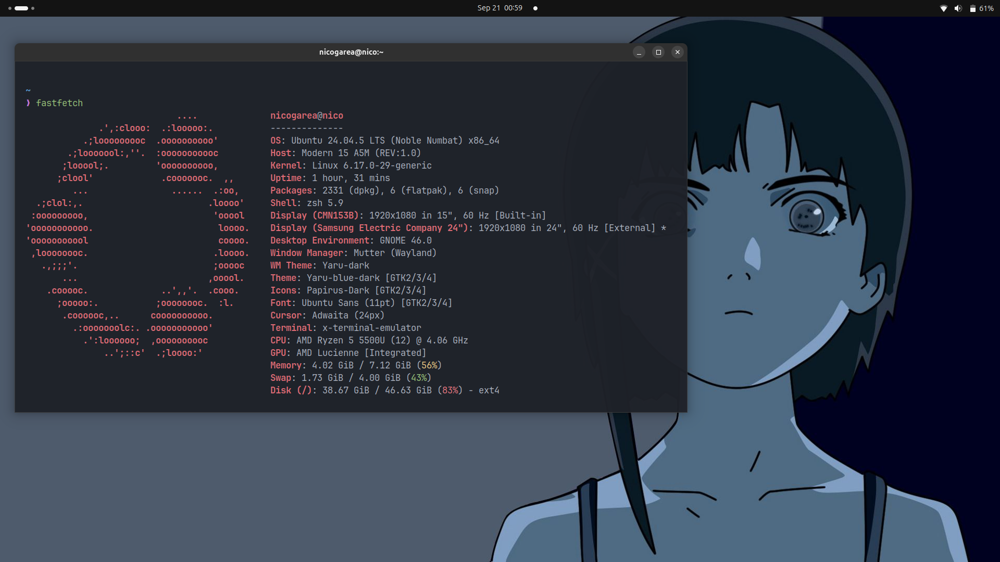

# dotfiles

My Ubuntu setup. zsh, Alacritty, VS Code, and the GNOME settings I forget
every time I reinstall.



## Install

```bash
git clone git@github.com:nicolasgarea/dotfiles.git ~/dotfiles
cd ~/dotfiles && ./install.sh
```

Add `--with-gnome` if you want the desktop too.

Nothing gets overwritten. Whatever is already there moves to
`~/.dotfiles-backup/` first, and running it twice does nothing the second
time.

Configs link into `~/.config` instead of being copied there. Edit one, you
edit both.

---

Wallpaper not included.